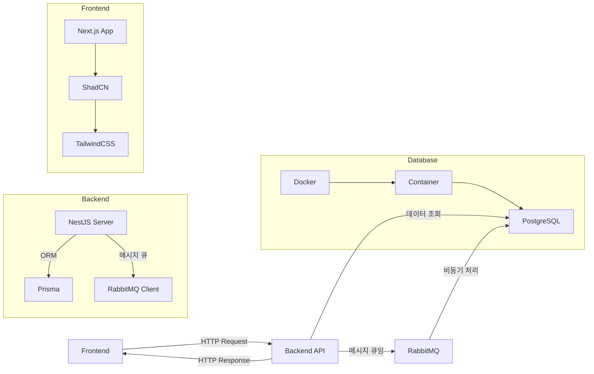

# Safe Map - AED 위치 안내 서비스

안전한 도시를 위한 AED(자동제세동기) 위치 안내 서비스입니다. Google Maps API를 활용하여 사용자 주변의 AED 위치를 쉽게 찾을 수 있도록 도와줍니다.

## 저장소 정보

- **GitHub**: [Thunder-punch/safe_map](https://github.com/Thunder-punch/safe_map)
- **개발자**: texclaim (texclaim@naver.com)

## 주요 기능

### 현재 구현된 기능
- 🗺️ Google Maps 기반 지도 서비스
- 📍 AED 위치 마커 표시
- 👤 사용자 현재 위치 표시
- 🔍 AED 정보 상세 보기
- 🎯 AED 표시/숨김 토글

### 개발 예정 기능
- 🔎 AED 검색 기능
- 📏 거리 기반 필터링
- 🚶 경로 안내 기능
- 📱 반응형 디자인
- 🌙 다크 모드 지원
- ⭐ 사용자 리뷰/평가 시스템
- 📝 AED 사용 방법 가이드
- 🚨 응급 상황 대처 방법 안내
- 🏃 대피소 위치 표시 및 안내
- 🧯 소화기 위치 표시 및 안내
- 🏥 응급실 위치 표시 및 안내
- 🎯 안전 시설 필터링 기능 (AED/대피소/소화기)
- 📊 안전 시설 밀집도 분석 및 표시

## 기술 스택

### Frontend
- **프레임워크**: Next.js 14
- **언어**: TypeScript
- **스타일링**: Tailwind CSS
- **UI 컴포넌트**: shadcn/ui
- **상태 관리**: React Hooks
- **아이콘**: Lucide React

### Backend & API
- **지도 API**: Google Maps JavaScript API
- **위치 서비스**: Geolocation API
- **데이터 형식**: CSV

### 개발 도구
- **패키지 매니저**: npm
- **코드 품질**: ESLint
- **코드 포맷팅**: Prettier
- **타입 체크**: TypeScript
- **버전 관리**: Git

### 배포
- **호스팅**: Vercel
- **CI/CD**: GitHub Actions

## 데이터 처리

- 대피소 raw_data 파일을 통합하여 하나의 CSV로 만드는 전처리 스크립트가 제공됩니다.
- 실행 명령어:
  ```
  python data/preprocess_shelter_raw_to_aed_format.py
  ```
- 데이터 전처리 및 좌표 보완에 사용된 기술스택:
  - Python 3
  - pandas
  - openpyxl
  - requests
  - Kakao 주소 검색 API (geocoding)

## 프로젝트 구조

```
safe_map/
├── app/                    # 페이지 컴포넌트
├── components/            # 재사용 가능한 컴포넌트
│   └── ui/               # UI 컴포넌트
├── lib/                  # 유틸리티 함수
├── public/              # 정적 파일
└── ...
```

## 시작하기

### 필수 조건
- Node.js 18.0.0 이상
- Google Maps API 키

### 설치
```bash
# 저장소 클론
git clone [repository-url]

# 의존성 설치
npm install

# 개발 서버 실행
npm run dev
```

### 환경 변수 설정
`.env.local` 파일을 생성하고 다음 변수를 설정하세요:
```
NEXT_PUBLIC_GOOGLE_MAPS_API_KEY=your_google_maps_api_key
```

## 기여하기

1. 이슈를 생성하거나 기존 이슈를 확인합니다.
2. 새로운 브랜치를 생성합니다 (`feature/your-feature-name`)
   ```bash
   git checkout -b feature/your-feature-name
   ```
3. 코드를 수정하고 커밋합니다.
   ```bash
   git add .
   git commit -m "설명"
   ```
4. 원격 저장소에 푸시합니다.
   ```bash
   git push origin feature/your-feature-name
   ```
5. GitHub에서 Pull Request(PR)를 생성하여 코드 리뷰 및 병합을 요청합니다.

## 데이터 흐름도

