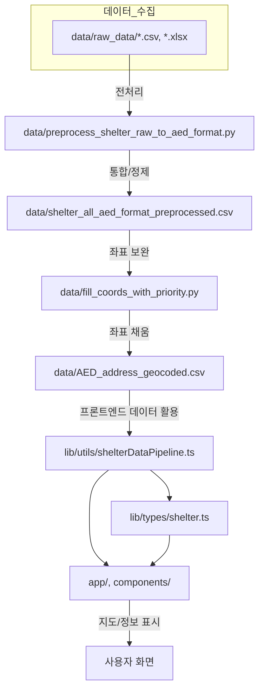

# Safe Map - AED 위치 안내 서비스

안전한 도시를 위한 AED(자동제세동기) 위치 안내 서비스입니다. Google Maps API를 활용하여 사용자 주변의 AED 위치를 쉽게 찾을 수 있도록 도와줍니다.

> **진행 현황**
> - 웹사이트를 Netlify에 배포 완료 (https://safemap.netlify.app)
> - PWA(Progressive Web App) 적용 및 manifest, 아이콘, 서비스워커 설정 완료
> - 모바일/데스크탑 반응형 UI 개선
> - 모바일에서 홈화면 추가(PWA 설치) 가능, 아이콘 정상 노출
> - 앱 마켓(구글 플레이 등) 등록 준비 단계
> - iOS/안드로이드 PWA 설치 안내문구 및 네이티브 패키징(필요시) 예정

> **배포 계획**
> - 본 프로젝트는 웹사이트를 먼저 배포한 후, 웹앱(PWA/하이브리드 앱 등)으로 패키징하여 앱 마켓(구글 플레이, 앱스토어 등)에 등록할 예정입니다.
> - 즉, **웹사이트 우선 배포 → 앱 패키징 및 마켓 등록** 순서로 진행합니다.

## 저장소 정보

- **GitHub**: [Thunder-punch/safe_map](https://github.com/Thunder-punch/safe_map)
- **개발자**: texclaim (texclaim@naver.com)

## 주요 기능

### 현재 구현된 기능
- 🗺️ Google Maps 기반 지도 서비스
- 📍 AED 위치 마커 표시
- 👤 사용자 현재 위치 표시
- 🔍 AED 정보 상세 보기
- 🎯 AED 표시/숨김 토글

### 개발 예정 기능
- 🔎 AED 검색 기능
- 📏 거리 기반 필터링
- 🚶 경로 안내 기능
- 📱 반응형 디자인
- 🌙 다크 모드 지원
- ⭐ 사용자 리뷰/평가 시스템
- 📝 AED 사용 방법 가이드
- 🚨 응급 상황 대처 방법 안내
- 🏃 대피소 위치 표시 및 안내
- 🧯 소화기 위치 표시 및 안내
- 🏥 응급실 위치 표시 및 안내
- 🎯 안전 시설 필터링 기능 (AED/대피소/소화기)
- 📊 안전 시설 밀집도 분석 및 표시

## 기술 스택

### Frontend
- **프레임워크**: Next.js 14
- **언어**: TypeScript
- **스타일링**: Tailwind CSS
- **UI 컴포넌트**: shadcn/ui
- **상태 관리**: React Hooks
- **아이콘**: Lucide React

### Backend & API
- **지도 API**: Google Maps JavaScript API
- **위치 서비스**: Geolocation API
- **데이터 형식**: CSV

### 개발 도구
- **패키지 매니저**: npm
- **코드 품질**: ESLint
- **코드 포맷팅**: Prettier
- **타입 체크**: TypeScript
- **버전 관리**: Git

### 배포
- **호스팅**: Netlify
- **CI/CD**: GitHub Actions

## 데이터 처리

- 대피소 raw_data 파일을 통합하여 하나의 CSV로 만드는 전처리 스크립트가 제공됩니다.
- 실행 명령어:
  ```
  python data/preprocess_shelter_raw_to_aed_format.py
  ```
- 데이터 전처리 및 좌표 보완에 사용된 기술스택:
  - Python 3
  - pandas
  - openpyxl
  - requests
  - Kakao 주소 검색 API (geocoding)

## 프로젝트 구조

```
safe_map/
├── app/                    # 페이지 컴포넌트
├── components/             # 재사용 가능한 컴포넌트
│   └── ui/                 # UI 컴포넌트
├── data/                   # 데이터 및 전처리 스크립트
│   ├── raw_data/           # 원본 데이터
│   ├── preprocess_shelter_raw_to_aed_format.py
│   ├── fill_coords_with_priority.py
│   ├── shelter_all_aed_format_preprocessed.csv
│   ├── AED_address_geocoded.csv
│   └── ...                 # 기타 데이터 파일
├── lib/                    # 유틸리티 함수 및 타입 정의
│   ├── types/
│   │   └── shelter.ts
│   └── utils/
│       ├── shelterDataPipeline.ts
│       └── shelterDataProcessor.ts
├── public/                 # 정적 파일
├── scripts/                # 데이터 처리/배포 스크립트
│   └── processShelterData.ts
├── README.md
└── ...
```

## 데이터/파일 흐름도



## 시작하기

### 필수 조건
- Node.js 18.0.0 이상
- Google Maps API 키

### 설치
```